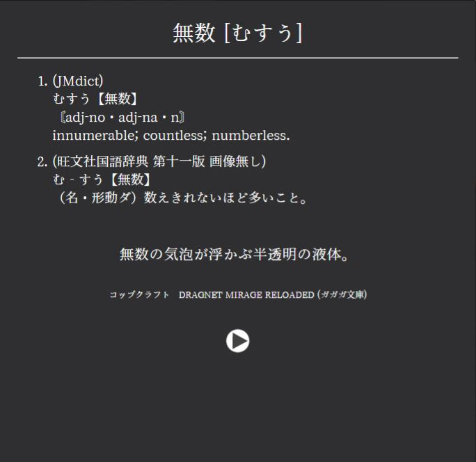
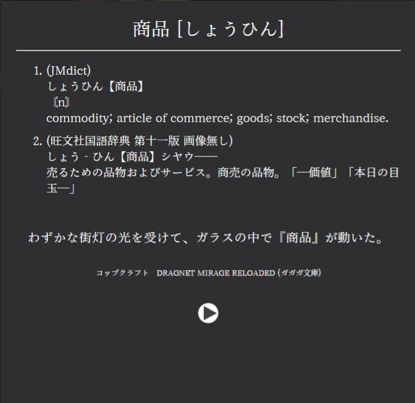
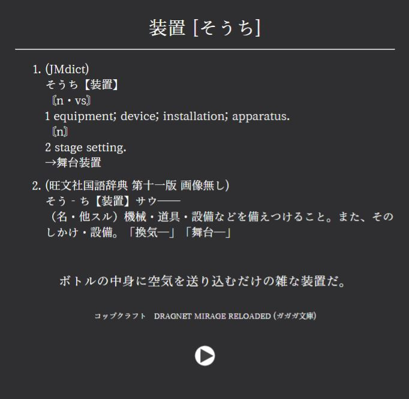

# Kindle2Anki

## Description
A simple script to create Anki cards for Japanse words from Kindle's Vocab-Builder using Yomichan dictionaries

# Features
- The script generates a ```Word, Reading, Definition, Sentence, Audio``` Anki card with definitions from how many Yomichan dictionaries you want and audio from JapanesePod
- You can specify which book you want to generate cards from and set a limit to how many cards the script will create
- You can specify the maximum frequency rank for the created cards, the script will ignore any words with a rank inferior to that
- The script will only try to create a card for a specific word once, if you delete a faulty card it will not be created again on the next run. As you run the script more times the amount of faulty cards is expected to diminish
- The script uses your existing anki templates, you can customize the cards look however you want

## Screenshots
<table>
  <tr>
    <td> </td>
    <td></td>
    <td></td>
    <td></td>
  </tr>
 </table>

# Requirements
This script requires you to have Kindle's Vocab-Builder(```単語帳```) active

[AnkiConnect](https://ankiweb.net/shared/info/2055492159)

[SudachiPy](https://pypi.org/project/SudachiDict-full/) ```pip install SudachiDict-full```

This script utilizes [Yomichan dictionaries](https://github.com/FooSoft/yomichan#dictionaries) and [ranked frequency lists](https://drive.google.com/drive/folders/1g1drkFzokc8KNpsPHoRmDJ4OtMTWFuXi)
### The script is not compatible with multiple-frequency frequency lists, please use one with only 1 frequency per word

# Installation
- Download the latest [release](https://github.com/Kartoffel0/Kindle2Anki/releases)
- Unzip the file

# Usage
### This script uses AnkiConnect, make sure you have Anki running before you run the script
- plug your kindle into your computer and grab the vocab.db file manually from your kindle's system folder```system/vocabulary/vocab.db```, or by searching for "vocab.db", and paste it in the same folder as the Kindle2Anki.py file
- Run the script

### First run setup
- You'll have to install your dictionaries and frequency lists, make sure you have all of them in the same folder as the Kindle2Anki.py file
- The script is not compatible with multiple-frequency frequency lists, please use one with only 1 frequency per word
- Be careful when entering your deck and card info, any mistypes will result in the script not working properly
#### You will only have to inform this once, on the next run you'll not be asked for the same info again

- Choose the book you want to mine from
- Choose how many cards you want the script to generate, it doesn't account for the duplicates so the actual number of generated cards probably is lower
- Wait for it to finish and when asked enter "OK" to close the script

## Note that:
- The script will only create cards for japanese words
- The script will not generate duplicate cards
- The cards are generated automatically, flaws are expected(even more with kindle's shitty text parser)
- The script will only try to create a card for a specific word once, if you delete a faulty card it will not be created again on the next run. As you run the script more times the amount of faulty cards is expected to diminish
